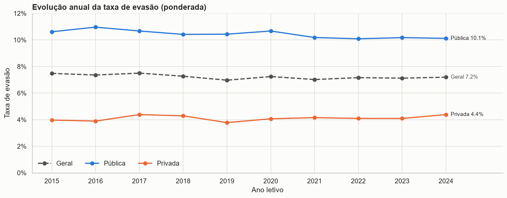
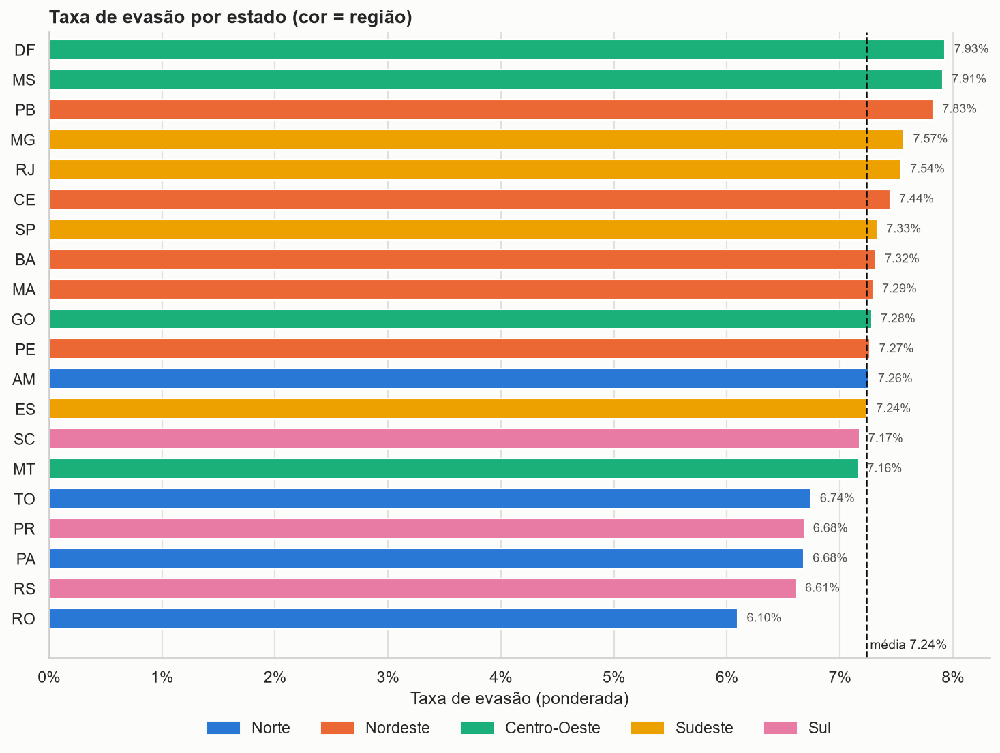

# Evasão Escolar no Ensino Médio Brasileiro (2015–2024)

**Projeto G1 — Tema 10** · Análise e visualização de dados com Python

| | |
|---|---|
| **Disciplina** | Linguagem de Programação — Análise e Visualização de Dados com Python |
| **Professor** | Alexandre Neves Louzada |
| **Aluno** | Enzo Ribas Torres |

| Entrega | Link |
|---|---|
| Dashboard (Streamlit Community Cloud) | https://projeto-evasao-escolar.streamlit.app/ |
| Página do projeto (GitHub Pages) | https://enzortorres.github.io/projeto-evasao-escolar/ |
| Repositório (GitHub) | https://github.com/enzortorres/projeto-evasao-escolar |
| Notebook | [`notebooks/analise_evasao_escolar.ipynb`](notebooks/analise_evasao_escolar.ipynb) |
| Código do dashboard | [`app.py`](app.py) e [`paginas/`](paginas/) |
| Base de dados | [`dados/simulacao_evasao_escolar_brasil.csv`](dados/simulacao_evasao_escolar_brasil.csv) |

---

## Sobre o projeto

A evasão escolar é um dos principais desafios da educação brasileira, com impacto direto sobre empregabilidade,
desigualdade econômica, qualidade da educação e inclusão social. Este projeto investiga os padrões de evasão no
ensino médio entre 2015 e 2024, usando uma base simulada com **1.480 registros semestrais** (37 municípios, 20 estados,
redes pública e privada, 1º ao 3º ano).

### Perguntas orientadoras

1. Quais estados apresentam maior evasão escolar?
2. Existem regiões mais vulneráveis?
3. A evasão aumentou ou diminuiu ao longo do tempo?
4. Há diferenças entre escolas públicas e privadas?
5. Existe relação entre renda e evasão?
6. Quais séries apresentam maior abandono?
7. Quais fatores parecem mais associados ao problema?

## Principais resultados

| KPI | Valor |
|---|---|
| Taxa média de evasão (ponderada) | **7,24%** |
| Total de evasões | **2.738.301** |
| Estado com maior evasão | **Distrito Federal** (7,93%) |
| Região mais vulnerável | **Centro-Oeste** (7,49%) |
| Rede mais afetada | **Pública** (10,43% contra 4,12% na privada) |
| Série mais crítica | **3º ano** no geral (7,35%) · **1º ano** na rede pública (10,51%) |



- **Rede de ensino é o fator dominante**: a taxa da rede pública é 2,5 vezes a da privada, em todos os anos, regiões e
  séries. Todos os registros em risco crítico são públicos.
- **Queda lenta**: de 7,48% em 2015 para 7,20% em 2024 (−0,039 p.p./ano). 2020 interrompeu a melhora.
- **Diferenças regionais moderadas**: 1,83 p.p. entre o estado com maior taxa (DF) e o com menor (RO).
- **Renda não explica a evasão nesta base** (r = −0,008). Desempenho tem associação fraca e inconsistente entre redes.



## Dashboard

App Streamlit **multipágina** com filtros globais na barra lateral (ano, semestre, região, estado, rede de ensino,
série e nível de risco) e upload opcional de outro CSV no mesmo layout.

| Página | Conteúdo |
|---|---|
| Visão geral | Título, descrição do problema, identificação, 8 KPIs dinâmicos, destaques e resumo da conclusão |
| Evolução temporal | Linha temporal por rede, tendência linear, heatmap semestral (região ou UF), série interativa (Plotly), tabela anual com média móvel |
| Regiões e estados | Mapa coroplético interativo (malha do IBGE), barras por estado, ranking e comparação regional |
| Redes e séries | KPIs pública × privada, boxplot, barras por série e composição dos níveis de risco |
| Fatores associados | Dispersão renda/desempenho/internet × evasão, quartis, matriz e tabela de correlação (Pearson/Spearman, p-valor) |
| Explorar dados e SQL | Tabela dinâmica configurável, editor SQL (somente leitura) e download da base filtrada |
| Conclusão executiva | Respostas às perguntas orientadoras, recomendações e limitações |

Todas as páginas têm interpretação textual que se ajusta ao recorte filtrado.

## Funcionalidades

**Intermediárias:** filtros múltiplos, KPIs dinâmicos, gráficos interativos, análise temporal, tratamento avançado de
dados, integração entre tabelas, upload de arquivos, dashboard organizado em seções, visualizações comparativas e
análise geográfica.

**Avançadas:**

| Funcionalidade | Tecnologia | Onde |
|---|---|---|
| Consumo de API | Requests (API de dados do IBGE) | [`src/ibge.py`](src/ibge.py) |
| Persistência em banco | SQLAlchemy + SQLite | [`src/banco.py`](src/banco.py), `database/` |
| Modelagem relacional | SQLAlchemy ORM (4 tabelas com chaves estrangeiras) | [`src/banco.py`](src/banco.py) |
| Dashboard multipágina | Streamlit `st.navigation` | [`app.py`](app.py), [`paginas/`](paginas/) |
| Mapa interativo | Plotly + GeoJSON do IBGE | [`src/graficos.py`](src/graficos.py) |
| Séries temporais | Pandas/NumPy (tendência, média móvel, variação) | [`src/analise.py`](src/analise.py) |
| Correlação estatística | Pandas/NumPy (Pearson, Spearman, p-valor) | [`src/analise.py`](src/analise.py) |
| Integração de múltiplas fontes | CSV + API + banco | todo o pipeline |

## Tratamento dos dados

| Etapa | Resultado |
|---|---|
| Nulos e duplicados | Nenhum encontrado |
| Registros impossíveis (evasões > matriculados) | Nenhum encontrado |
| Taxa de evasão incoerente com evasões ÷ matriculados | **16 registros recalculados** |
| Índice de desempenho acima de 100 | **2 registros ajustados** para o intervalo 0–100 |
| Engenharia de atributos | Período semestral, permanências, quartis de renda/desempenho/internet, nome e código IBGE das UFs |

As taxas agregadas são sempre **ponderadas pelas matrículas** (soma das evasões ÷ soma dos matriculados).

## Estrutura

```
projeto-evasao-escolar/
├── app.py                  # entrada do dashboard: dados, filtros globais, navegação
├── paginas/                # páginas do dashboard multipágina
├── src/
│   ├── config.py           # identificação, caminhos e paleta
│   ├── dados.py            # leitura, limpeza, atributos e filtros
│   ├── ibge.py             # consumo da API do IBGE
│   ├── banco.py            # modelos SQLAlchemy e consultas SQL
│   ├── analise.py          # KPIs, tendência, correlações e textos
│   ├── graficos.py         # gráficos Matplotlib/Seaborn/Plotly
│   └── ui.py               # componentes visuais
├── requirements.txt
├── README.md
├── index.html              # página do GitHub Pages
├── css/style.css           # estilos da página
├── dados/                  # CSV original, CSV tratado e cache do IBGE
├── database/               # evasao_escolar.sqlite
├── notebooks/              # analise_evasao_escolar.ipynb
└── imagens/                # gráficos exportados pelo notebook
```

## Como executar

```bash
python -m venv .venv
.venv\Scripts\activate          # Windows  (Linux/macOS: source .venv/bin/activate)
pip install -r requirements.txt
streamlit run app.py
```

O notebook pode ser aberto no VS Code ou no Jupyter (`pip install jupyter`) a partir da pasta `notebooks/`.

## Tecnologias

Python · Pandas · NumPy · Matplotlib · Seaborn · Plotly · Streamlit · SQLAlchemy · SQLite · Requests · GitHub Pages

## Limitações

A base é **simulada** e serve para fins educacionais; os resultados não são estatísticas oficiais. A análise é descritiva:
correlação não implica causalidade.
